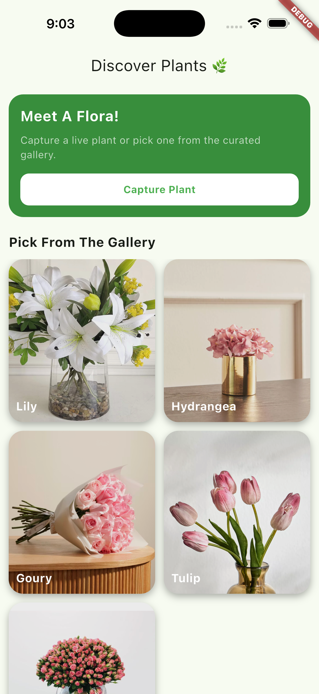
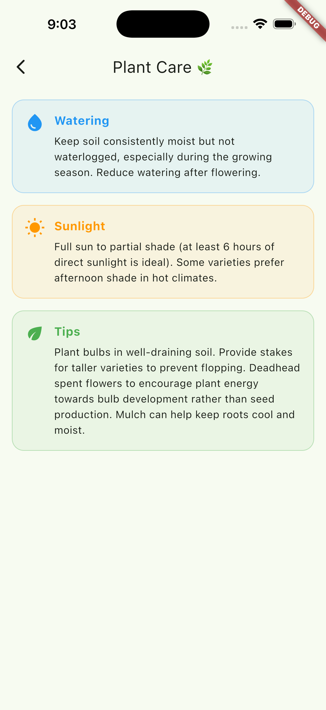

# 🌿 Meet A Flora

A Flutter application that helps users explore plants and get AI-powered details about them.

---

## ✨ Features

* 🌱 Browse a curated list of plants
* 🤖 Get AI-generated plant care details
* 🖼️ Beautiful and clean UI design
* ⚡ Fast and responsive experience
* 🔗 Easy navigation using GoRouter

---

## 📱 Screens

### 🏠 Home Screen

Displays a grid of plants with a modern UI.



---

### 🤖 Plant Details Screen

Shows AI-generated information about the selected plant.



---

## 🛠️ Tech Stack

* **Flutter**
* **Dart**
* **GoRouter** (Navigation)
* **Dio** (Networking)
* **GetIt & Injectable** (Dependency Injection)
* **Gemini API** (AI Integration)

---

## 📂 Project Structure

```
lib/
├── core/
│   ├── network/
│   ├── services/
│   └── errors/
│
├── features/
│   ├── plant/
│   │   ├── data/
│   │   ├── domain/
│   │   └── presentation/
│   │
│   └── plant_details_ai/
│       ├── data/
│       ├── domain/
│       └── presentation/
│
└── main.dart
```

---

## 🚀 Getting Started

### 1. Clone the project

```bash
git clone https://github.com/AmaalAlanazi/meet-a-flora.git
cd meet-a-flora
```

---

### 2. Install dependencies

```bash
flutter pub get
```

---

### 3. Add API Key

Create a `.env` file in the root:

```env
GEMINI_API_KEY=your_api_key_here
```

---

### 4. Run the app

```bash
flutter run
```

---

## 📸 Screenshots

> Replace with your actual screenshots

* `assets/screens/home.png`
* `assets/screens/details.png`

---

## 🧠 Notes

* Make sure to run:

```bash
flutter pub run build_runner build --delete-conflicting-outputs
```

* Ensure your assets are added in `pubspec.yaml`

---

## 👩‍💻 Author

**Amaal Alanazi**

---

## 📄 License

This project is for educational purposes.
